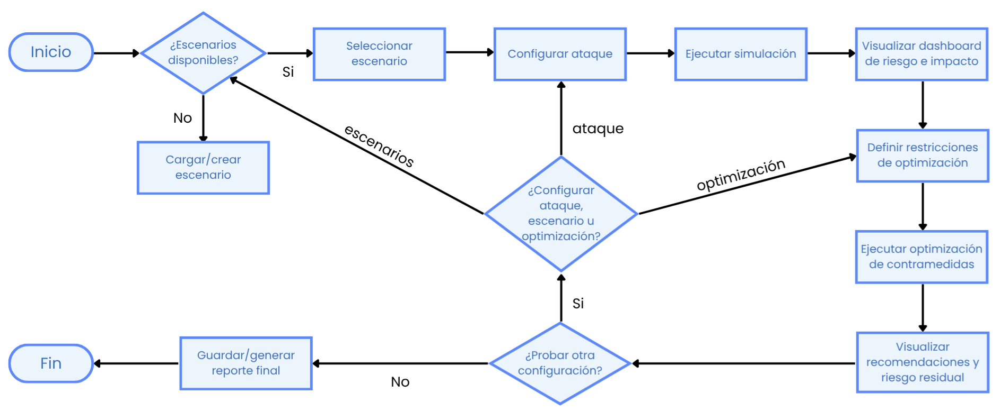
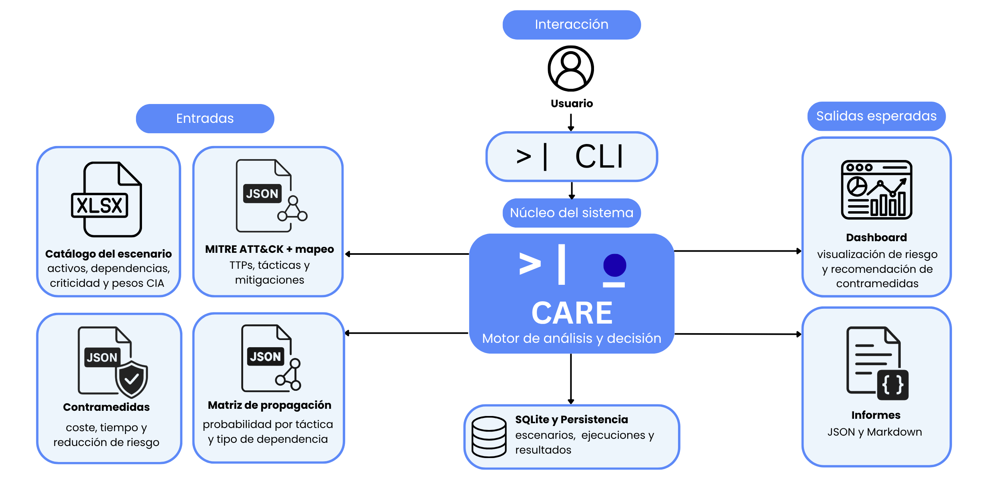
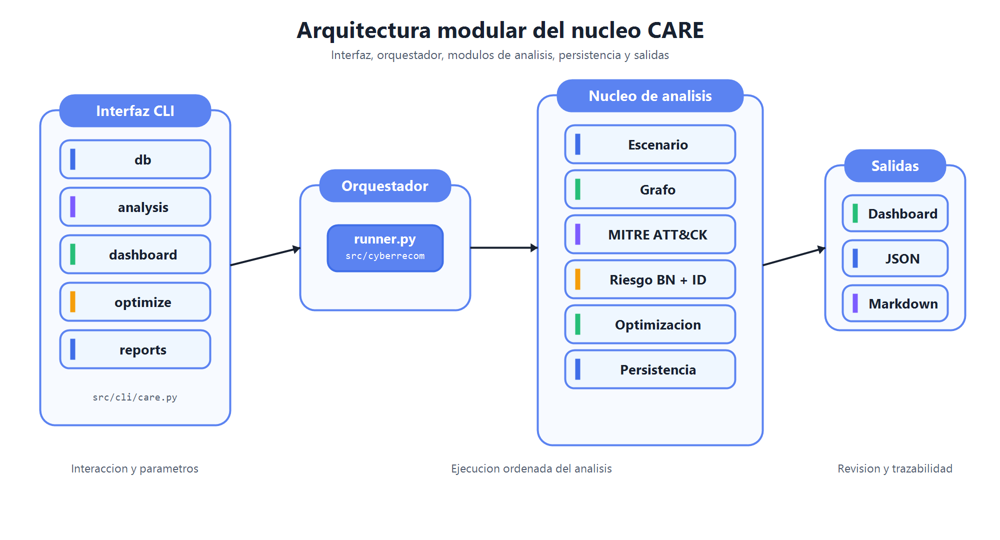
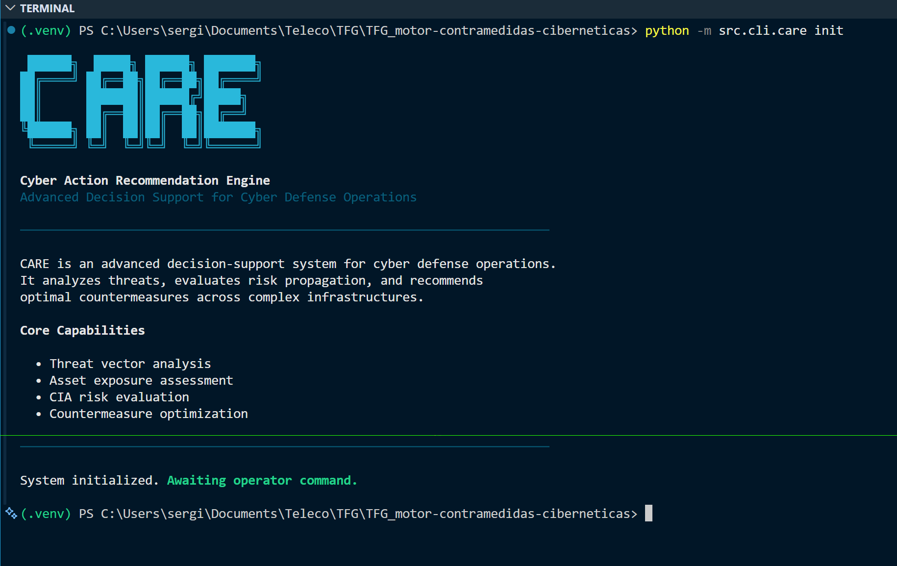
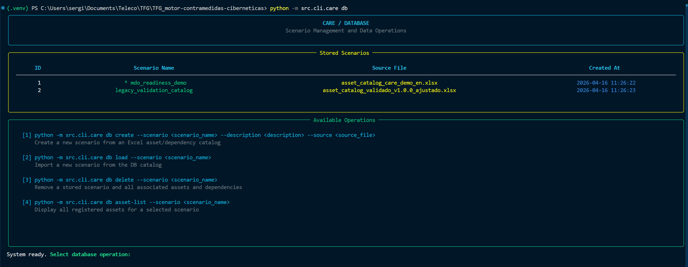
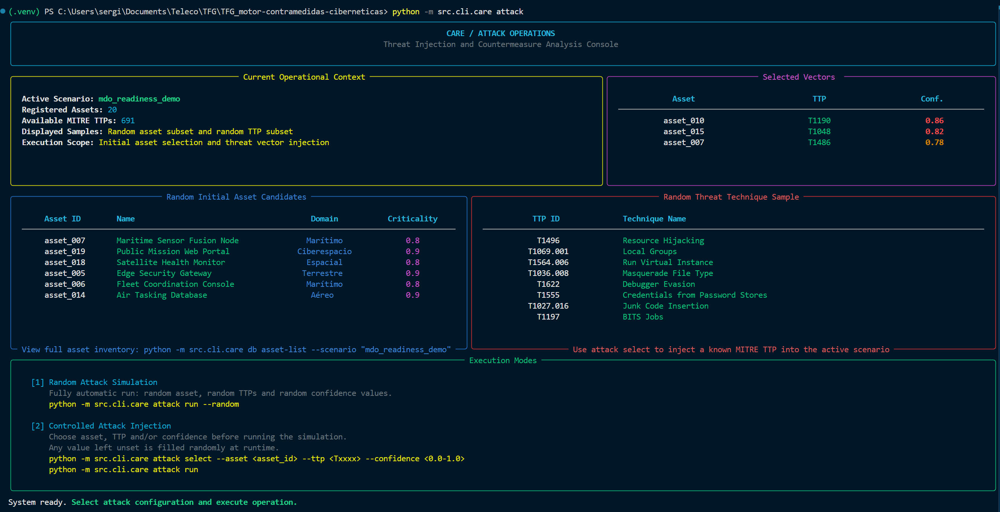
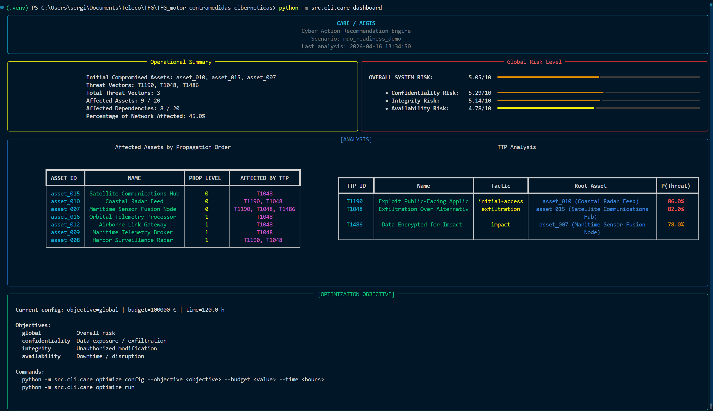
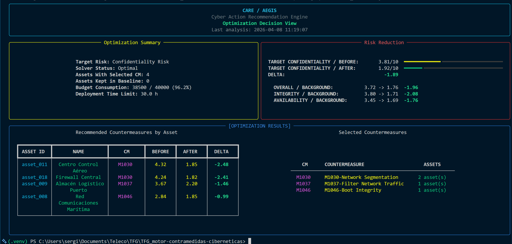
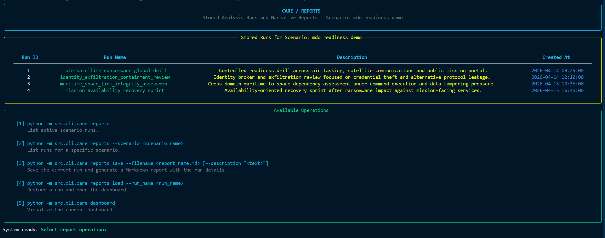
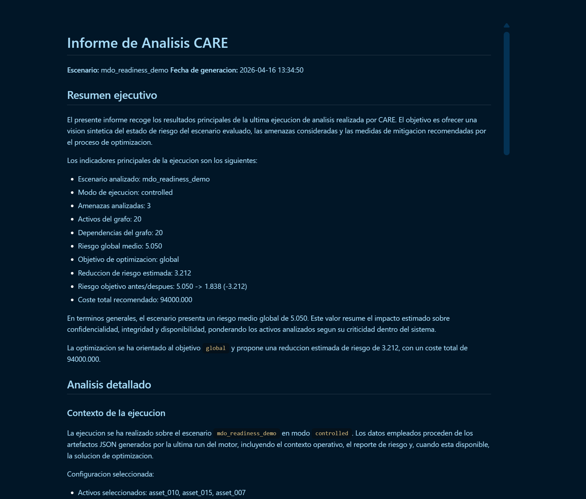

# CARE

## Cyber Action Recommendation Engine

**Motor académico para analizar riesgo en ciberseguridad y recomendar contramedidas de forma trazable.**

CARE es un proyecto desarrollado como Trabajo de Fin de Grado. Integra modelado de activos, análisis de dependencias, MITRE ATT&CK, inferencia probabilística, evaluación de riesgo CIA y optimización de contramedidas en un flujo reproducible.

El sistema parte de un catálogo de activos, construye un grafo dirigido de dependencias, analiza escenarios de seguridad sobre la infraestructura, estima riesgo residual y propone combinaciones de mitigación bajo restricciones de coste y tiempo.

| Entrada | Proceso | Salida |
| --- | --- | --- |
| Catálogo de activos, dependencias y configuración del escenario | Construcción del grafo, análisis MITRE, inferencia de riesgo y optimización | Dashboard, JSON estructurado, solución de mitigación e informe Markdown |

---

## Objetivos

- Representar una infraestructura como un grafo dirigido de activos y dependencias.
- Incorporar MITRE ATT&CK como marco estructurado para el análisis.
- Estimar riesgo residual en Confidencialidad, Integridad y Disponibilidad.
- Evaluar contramedidas candidatas mediante modelos probabilísticos.
- Optimizar decisiones de mitigación bajo restricciones de presupuesto y tiempo.
- Generar salidas reproducibles mediante dashboard, JSON e informes Markdown.

---

## Aportación Técnica

| Área | Aportación |
| --- | --- |
| Modelado | Define activos, dominios, criticidad, pesos CIA y dependencias. |
| Grafo | Representa relaciones entre activos y permite analizar propagación. |
| MITRE ATT&CK | Relaciona referencias ATT&CK con tácticas y mitigaciones. |
| Riesgo | Calcula riesgo residual por activo y dimensión CIA. |
| Decisión | Selecciona contramedidas considerando coste, tiempo y objetivo. |
| Trazabilidad | Conserva contexto, resultados y reportes de cada ejecución. |

---

## Criterios de Diseño

| Criterio | Aplicación en CARE |
| --- | --- |
| Trazabilidad | Cada ejecución conserva escenario, contexto, resultados y artefactos generados. |
| Reproducibilidad | Los análisis pueden guardarse, restaurarse y documentarse mediante informes. |
| Modularidad | El código separa CLI, persistencia, grafo, riesgo, optimización y reporting. |
| Explicabilidad | Las salidas permiten revisar cómo se llega desde el escenario hasta la recomendación. |
| Flexibilidad | El usuario puede variar escenario, referencias MITRE, confianza, objetivo y restricciones. |

---

## Flujo de Análisis

El flujo completo de CARE se resume en el siguiente flujograma:



De forma resumida, el proceso es:

```text
Catálogo de activos
    |
    v
Base de datos de escenarios
    |
    v
Grafo de dependencias
    |
    v
Análisis de escenario MITRE ATT&CK
    |
    v
Propagación por dependencias
    |
    v
Inferencia bayesiana de riesgo CIA
    |
    v
Evaluación de contramedidas
    |
    v
Optimización con restricciones
    |
    v
Dashboard + JSON + informe Markdown
```

---

## Arquitectura

La arquitectura puede leerse en dos niveles. En primer lugar, CARE recibe catálogos y configuración, ejecuta el análisis en su núcleo interno y produce resultados consultables en dashboard, JSON e informes.



En segundo lugar, el núcleo se organiza en módulos diferenciados. La interfaz CLI coordina las vistas de usuario, el orquestador ejecuta el flujo de análisis y los módulos especializados resuelven escenario, grafo, MITRE, riesgo, optimización y persistencia.



| Capa | Responsabilidad |
| --- | --- |
| CLI | Entrada de usuario, selección de escenario, análisis, dashboard, optimización y reportes. |
| Base de datos | Persistencia de escenarios, activos, dependencias y ejecuciones. |
| Grafo | Construcción de topología, dominios, dependencias y propagación. |
| MITRE | Consulta de referencias, tácticas y mitigaciones ATT&CK. |
| Riesgo | Inferencia bayesiana, diagramas de influencia y cálculo de riesgo CIA. |
| Optimización | Selección de contramedidas bajo presupuesto y tiempo máximo. |
| Reporting | Exportación JSON, generación Markdown y restauración de ejecuciones. |

---

## Estructura del Proyecto

```text
CARE/
|-- configs/
|   |-- bn_CPDs_template.json       # Plantilla de CPDs para la red bayesiana
|   |-- countermeasures.json        # Catálogo de contramedidas, costes y efectos esperados
|   |-- dependency_matrix.json      # Probabilidades de propagación por táctica y dependencia
|   |-- ttps_to_mitigations.json    # Relación entre referencias MITRE y mitigaciones candidatas
|   |-- requirements.txt            # Dependencias Python
|
|-- data/
|   |-- enterprise-attack.json      # Dataset local MITRE ATT&CK Enterprise
|   |-- use-case-corporativo.xlsx   # Escenario de ejemplo
|   |-- asset_catalog_*.xlsx        # Catálogos de activos de ejemplo
|
|-- images/
|   |-- *.png                       # Figuras de arquitectura, flujo y capturas auxiliares
|
|-- src/
|   |-- cli/
|   |   |-- care.py                 # Entry point principal de la CLI
|   |   |-- attack.py               # Vista operativa del análisis MITRE
|   |   |-- dashboard.py            # Dashboard de resultados
|   |   |-- db.py                   # Gestión de escenarios
|   |   |-- report.py               # Vista de runs y reportes
|   |
|   |-- cyberrecom/
|   |   |-- runner.py               # Orquestación end-to-end del análisis
|   |   |-- mitre.py                # Integración con datos MITRE ATT&CK
|   |
|   |-- database/
|   |   |-- tfg_catalog.db          # SQLite con escenarios, activos, dependencias y runs
|   |   |-- load_data.py            # Carga y comprobación de Excel
|   |   |-- reports_db.py           # Persistencia y restauración de reportes
|   |
|   |-- graph/
|   |   |-- grafo.py                # Construcción del grafo y propagación
|   |
|   |-- reporting/
|   |   |-- report.py               # Generación de JSON y Markdown
|   |   |-- report.json             # Último reporte estructurado generado
|   |   |-- optimization_solution.json
|   |
|   |-- risk/
|       |-- red_bayes.py            # Red bayesiana de riesgo residual
|       |-- id_test.py              # Diagramas de influencia
|       |-- optimization.py         # Modelo de optimización
|
|-- text/                           # Memoria y documentación académica
|-- deprecated/                     # Versiones antiguas conservadas por trazabilidad
|-- README.md
```

---

## Requisitos

### Software

| Requisito | Versión recomendada | Uso |
| --- | --- | --- |
| Python | 3.10 o superior | Ejecución del motor y la CLI. |
| pip | Incluido con Python | Instalación de dependencias. |
| Entorno virtual | `venv` | Aislar dependencias del sistema. |
| Terminal | PowerShell, Windows Terminal, Bash o similar | Renderizado de la CLI Rich. |

En Windows, si `python` abre el alias de Microsoft Store, usa `py -3`.

### Dependencias Python

Las dependencias están definidas en [configs/requirements.txt](./configs/requirements.txt):

| Librería | Uso principal |
| --- | --- |
| `pandas`, `openpyxl` | Carga y procesamiento de catálogos Excel. |
| `networkx` | Construcción y análisis del grafo. |
| `mitreattack-python` | Uso local de conocimiento MITRE ATT&CK. |
| `pgmpy`, `pyAgrum` | Inferencia bayesiana y diagramas de influencia. |
| `pulp`, `scipy`, `numpy` | Optimización y cálculo numérico. |
| `rich`, `tabulate`, `matplotlib` | Interfaz en terminal, tablas y visualización auxiliar. |

---

## Instalación

### Windows PowerShell

```powershell
py -3 -m venv .venv
.\.venv\Scripts\Activate.ps1
python -m pip install --upgrade pip
pip install -r configs\requirements.txt
```

### Linux / macOS

```bash
python3 -m venv .venv
source .venv/bin/activate
python -m pip install --upgrade pip
pip install -r configs/requirements.txt
```

### Comprobación

```bash
python -m src.cli.care --help
```

La CLI debe mostrar los comandos principales:

```text
init, db, attack, dashboard, optimize, reports
```

---

## Cómo Se Ejecuta

CARE se ejecuta desde el módulo principal:

```bash
python -m src.cli.care
```

### 1. Inicializar el contexto

```bash
python -m src.cli.care init
```

Este comando crea o reinicia el contexto de trabajo en `src/cli/context.json`.

### 2. Cargar un escenario existente

```bash
python -m src.cli.care db load --scenario use-case-corporativo
```

Para listar los activos del escenario:

```bash
python -m src.cli.care db asset-list --scenario use-case-corporativo
```

### 3. Crear un escenario desde Excel

En PowerShell:

```powershell
python -m src.cli.care db create ^
  --scenario nuevo-escenario ^
  --description "Escenario corporativo de ejemplo" ^
  --source data\use-case-corporativo.xlsx
```

En Bash:

```bash
python -m src.cli.care db create \
  --scenario nuevo-escenario \
  --description "Escenario corporativo de ejemplo" \
  --source data/use-case-corporativo.xlsx
```

### 4. Configurar un análisis

El comando mantiene el nombre `attack` por compatibilidad con la implementación de la CLI. En el contexto del proyecto se utiliza como módulo de análisis de referencias MITRE sobre activos.

```bash
python -m src.cli.care attack select --asset <asset_id> --ttp <ttp_id> --confidence <confidence>
```

Ejemplo:

```bash
python -m src.cli.care attack select --asset ACME_IDP --ttp T1003 --confidence 0.82
```

### 5. Ejecutar el análisis

```bash
python -m src.cli.care attack run
```

También puede ejecutarse un análisis exploratorio:

```bash
python -m src.cli.care attack run --random
```

### 6. Consultar el dashboard

```bash
python -m src.cli.care dashboard
```

### 7. Configurar y ejecutar la optimización

Objetivos admitidos:

- `global`
- `confidentiality`
- `integrity`
- `availability`

Ejemplo:

```bash
python -m src.cli.care optimize config --objective global --budget 70000 --time 30
python -m src.cli.care optimize run
```

### 8. Guardar una ejecución y generar informe

```bash
python -m src.cli.care reports save --filename informe-care.md --description "Ejecución de análisis CARE"
```

El informe se genera en:

```text
src/reporting/informe-care.md
```

### 9. Listar y restaurar ejecuciones

```bash
python -m src.cli.care reports --scenario use-case-corporativo
python -m src.cli.care reports load --run_name informe-care
```

## Superficie CLI

| Comando | Propósito |
| --- | --- |
| `init` | Inicializa el contexto de ejecución. |
| `db load` | Carga un escenario existente como escenario activo. |
| `db create` | Crea un escenario desde un Excel de activos y dependencias. |
| `db delete` | Elimina un escenario persistido. |
| `db asset-list` | Lista activos de un escenario. |
| `attack select` | Añade activo, referencia MITRE y confianza al contexto. |
| `attack run` | Ejecuta el análisis configurado. |
| `attack run --random` | Ejecuta un análisis exploratorio. |
| `dashboard` | Renderiza el último análisis disponible. |
| `optimize config` | Define objetivo, presupuesto y tiempo máximo. |
| `optimize run` | Resuelve la selección óptima de contramedidas. |
| `reports` | Lista ejecuciones guardadas. |
| `reports save` | Guarda la ejecución actual y genera Markdown. |
| `reports load` | Restaura una ejecución previa desde SQLite. |

---

## Formato del Catálogo Excel

Para crear un escenario desde Excel, el fichero debe incluir dos hojas: `Assets` y `Dependencies`.

### Hoja `Assets`

| Columna | Descripción |
| --- | --- |
| `asset_id` | Identificador único del activo. |
| `name` | Nombre legible del activo. |
| `asset_type` | Tipo de activo. |
| `domain` | Dominio funcional o tecnológico. |
| `criticality` | Criticidad del activo. |
| `cia_c` | Peso de Confidencialidad. |
| `cia_i` | Peso de Integridad. |
| `cia_a` | Peso de Disponibilidad. |
| `operational_state` | Estado operativo. |

### Hoja `Dependencies`

| Columna | Descripción |
| --- | --- |
| `dependency_id` | Identificador único de la dependencia. |
| `from_asset` | Activo dependiente. |
| `to_asset` | Activo del que depende. |
| `dependency_type` | Tipo de dependencia. |
| `cia_couple_c` | Acoplamiento en Confidencialidad. |
| `cia_couple_i` | Acoplamiento en Integridad. |
| `cia_couple_a` | Acoplamiento en Disponibilidad. |

Validaciones aplicadas:

- No puede haber `asset_id` duplicados.
- Cada dependencia debe apuntar a activos existentes.
- Los pesos `cia_c + cia_i + cia_a` deben sumar aproximadamente `1.0`.

---

## Artefactos Generados

| Artefacto | Descripción |
| --- | --- |
| `src/cli/context.json` | Estado actual de la sesión CLI. |
| `configs/bn_CPDs.json` | CPDs dinámicas activas para la inferencia bayesiana. |
| `src/reporting/report.json` | Reporte estructurado de riesgo y activos afectados. |
| `src/reporting/optimization_solution.json` | Solución de optimización y decisiones por activo. |
| `src/reporting/<run_name>.md` | Informe narrativo generado al guardar una ejecución. |
| `src/database/tfg_catalog.db` | SQLite con escenarios, activos, dependencias y ejecuciones. |

---

## Configuración Principal

| Fichero | Función |
| --- | --- |
| `configs/constants.json` | Tipos de activos y dependencias reconocidos. |
| `configs/dependency_matrix.json` | Probabilidades de propagación por táctica y tipo de dependencia. |
| `configs/countermeasures.json` | Catálogo de controles, coste, tiempo y efecto probabilístico. |
| `configs/ttps_to_mitigations.json` | Mapeo entre referencias ATT&CK y mitigaciones candidatas. |
| `configs/bn_CPDs_template.json` | Plantilla base para construir CPDs dinámicas. |
| `data/enterprise-attack.json` | Dataset local de MITRE ATT&CK Enterprise. |

---

## Alcance y Limitaciones

CARE es un prototipo académico orientado al análisis y a la evaluación conceptual. Sus resultados deben interpretarse dentro de las hipótesis del modelo y del escenario introducido.

- La calidad del análisis depende de la calidad del catálogo de activos y dependencias.
- Las probabilidades y efectos de mitigación son configurables y requieren calibración.
- La salida del optimizador sirve como apoyo a la decisión, no como acción automática.
- El proyecto prioriza trazabilidad y explicación frente a integración con sistemas reales.

---

## Líneas Futuras

Las líneas futuras planteadas en la memoria se orientan a aproximar CARE a condiciones de operación más realistas y reforzar su utilidad como herramienta de apoyo a la decisión:

- Ampliar el motor de optimización hacia un enfoque multiobjetivo y multicriterio, incorporando criterios como reducción del riesgo, impacto operativo, tiempo de despliegue, disponibilidad y viabilidad económica.
- Enriquecer el modelo de contramedidas para contemplar efectos secundarios, incompatibilidades y dependencias entre medidas defensivas.
- Permitir la configuración dinámica de contramedidas por parte del operador, de forma que puedan seleccionarse, activarse o descartarse medidas y observar cómo varía el riesgo residual.
- Enriquecer la parametrización probabilística del modelo ajustando las CPDs a partir de evidencias procedentes de históricos de incidentes, plataformas SIEM o EDR, ejercicios de red teaming o purple teaming y datos obtenidos mediante honeypots.
- Incorporar vulnerabilidades concretas en el análisis de riesgo, considerando CVE presentes en cada activo y métricas como CVSS o EPSS.
- Incorporar un enfoque reactivo de recomendación de contramedidas, orientado a sugerir acciones defensivas una vez identificada una amenaza concreta o detectada una técnica determinada sobre el escenario.

---

## Capturas de Ejecución

Las siguientes capturas muestran el comportamiento esperado de la interfaz CLI durante una ejecución típica. Se incluyen al final como apoyo visual para revisar el flujo de uso, desde la inicialización del contexto hasta la generación del informe.

### Inicialización del Sistema



### Gestión de Escenarios



### Configuración del Análisis



### Dashboard de Riesgo



### Optimización de Contramedidas



### Gestión de Ejecuciones e Informes



### Informe Markdown Generado



---

## Autor

**Sergio Gutierrez**  
Grado en Ingeniería de Tecnologías y Servicios de Telecomunicación  
ETSIT - Universidad Politécnica de Madrid

GitHub: [serguccierrez](https://github.com/serguccierrez)
